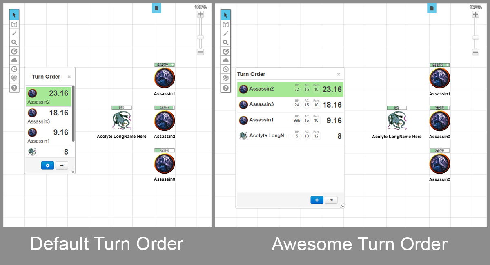

# Awesome Turn Order for Roll20

A small browser extension to help GMs with more informative Turm Order dialog view. No configs are required

Inspired by similar view upgrades provided by [VTT Enhancement Suite](https://justas-d.github.io/roll20-enhancement-suite/) and [5eTools](https://5e.tools/).

**Known issues**

1. No additional info is showing on refresh page with a cache clean. Solution: regular page refresh
2. Missing of some additional info numbers for some tokens. Don't worry, it will be fixed after you click "→" button
